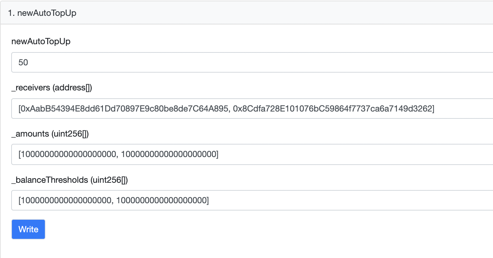
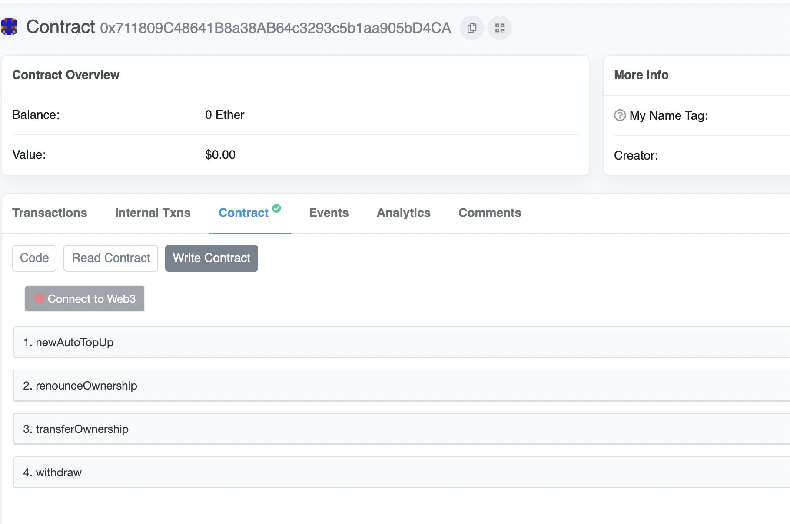
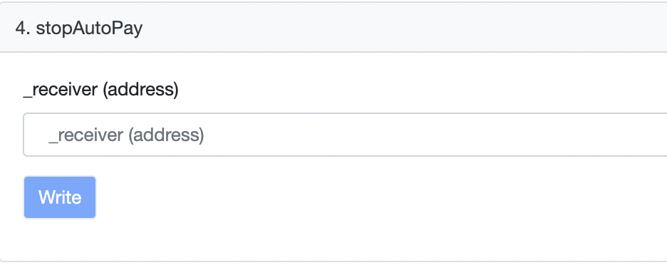

# Gelato Auto Top Up

Auto Top Up multiple ETH addresses automatically once they go below a certain ETH balance threshold.

## Description

Deploy your own AutoTopUp Instance using the `AutoTopUpFactory`, send some ETH to it and define which addresses to monitor, below which balance you want to auto top them up and how much to top each address up respectively.

## Addresses

### Mainnet: 

- [AutoTopUpFactory](https://etherscan.io/address/0x711809c48641b8a38ab64c3293c5b1aa905bd4ca)

### Ropsten: 

- [AutoTopUpFactory](https://ropsten.etherscan.io/address/0x0ae26E3518fd10f2949c6326B150B20A929f984C)

## Tutorial - Deploy your own AutoTopUp Contract that tops up multiple addresses automatically on your behalf:

1. Visit the AutoTopUpFactory Page on [Etherscan](https://etherscan.io/address/0x711809c48641b8a38ab64c3293c5b1aa905bd4ca#writeContract) 
2. Connect to your Web3 Wallet and click `newAutoTopUp`
  
3. Fill in the details of `newAutoTopUp`. 
   1. newAutoTopUp: How much ETH to deposit in your individual AutoTopUp Contract
   2. _receivers: An array of addresses whose balances you want to monitor
   3. _amounts: An array of amounts that define with how much ETH you want these respective addresses to be topped up
   4. _balanceThreshold: An array of amounts that define below which balances you want the respective addresses to be topped up with the respective amount
4. Click Write and submit the transaction

5. Git clone this repo and run `npx hardhat verify --network mainnet  {YOUR_AUTO_TOP_UP_ADDRESS} "0x3CACa7b48D0573D793d3b0279b5F0029180E83b6"` to verify your AutoTopUp contracts address on Etherscan
6. If you want to stop one of the auto topus, visit your AutoTopUp instance on Etherscan and input the receiver address in the `_stopAutoPay` function

## Local Setup

1. Put in your `ALCHEMY_ID` in `.env`
2. Run `yarn`

## Tests

Run: `yarn test`
